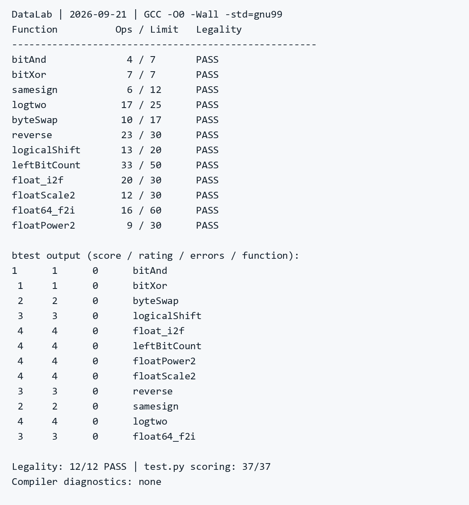

# datalab 报告

姓名：江易洋

学号：2025201891

| 总分 | bitAnd | bitXor | samesign | logtwo | byteSwap | reverse |
| --- | --- | --- | --- | --- | --- | --- |
| 37/37 | 1/1 | 1/1 | 2/2 | 4/4 | 4/4 | 3/3 |

| logicalShift | leftBitCount | float_i2f | floatScale2 | float64_f2i | floatPower2 |
| --- | --- | --- | --- | --- | --- |
| 3/3 | 4/4 | 4/4 | 4/4 | 3/3 | 4/4 |

test 截图：



<!-- pagebreak -->

## 解题报告

### 亮点

1. logtwo：用按位或累计二分定位结果，避免加法。
2. logicalShift：用同一掩码表达式处理零位移。
3. float_i2f：用一个条件完成最近偶数舍入。
4. floatScale2：尾数左移自然完成非规格化数到规格化数的转换，无需额外特判。

### bitAnd

由德摩根律，用 `~(~x | ~y)` 实现与运算，共 4 个操作符。

### bitXor

```c
return ~(x & y) & ~(~x & ~y);
```

两个子式分别排除对应位同为 1、同为 0 的情况，相与后只保留两位不同的情况，共 7 个操作符。

### samesign

先处理零：只有两个数均为零时才算同号。非零时，用 `!((x ^ y) >> 31)` 判断符号位是否相同。

### logtwo

按 16、8、4、2、1 位二分定位最高的 1，每轮右移已确认的位数。各轮贡献位于不同的二进制位，因此可用 `a |= y` 代替加法累计，最后用 `v >> 1` 确定最低一位。

### byteSwap

```c
int d = ((x >> n8) ^ (x >> m8)) & 0xff;
return x ^ (d << m8) ^ (d << n8);
```

n8、m8 是字节对应的位偏移。先提取两字节的差异，再移回原位置并异或，翻转不同的位以完成交换。两个位置相同时 d 为 0。

### reverse

依次交换相邻的 16、8、4、2、1 位组。每轮用掩码选出每组的一半，左右移位后取或，最终将第 i 位送到第 31-i 位。unsigned 右移补零。

### logicalShift

对算术右移结果加掩码，只保留低 32-n 位。令 `b = !!n`、k 为 n-b：n 大于 0 时，`~(top >> k)` 清除高 n 位；n 为 0 时，用 `top & (b + ~0)` 补回最高位，得到全 1 掩码。k 始终在 0 到 30 之间。

### leftBitCount

取反后按 16、8、4、2、1 位二分统计前导零，每轮根据已累计的 a 调整右移量。五轮最多得到 31；原输入为 -1 时，取反为 0，最后用 `a + !x` 补到 32。

<!-- pagebreak -->

### float_i2f

零直接返回。其余输入先保存符号，用 `ux = -ux` 避免对 INT_MIN 做有符号取负。将 ux 左移至最高位为 1，阶码从 31+127 开始随移位递减，再取隐含位后的 23 位作为尾数 M。

低 8 位用于最近偶数舍入：大于 `0x80` 时进位，等于时仅在 M 为奇数时进位，合并为：

```c
if ((ux & 0xff) + (M & 1) > 0x80)
```

若进位后 M 达到 `0x00800000`，则清零 M、阶码加 1，最后拼接符号、阶码和尾数。

### floatScale2

按阶码 E 分类：`0xff` 时原样返回；0 时保留符号、尾数左移一位；`0xfe` 时返回同号无穷，清零尾数；其余情况将阶码加 1。

非规格化数的尾数左移后，若最高位进入阶码最低位，阶码就自然变为 1，完成规格化；否则仍为非规格化数。两种表示在边界处使用相同的实际指数 -126，因此无需额外调整尾数或特判转换。

### float64_f2i

阶码小于 1023 时返回 0；无穷、NaN 或实际指数 E 大于等于 31 时返回 `0x80000000`，合法边界 -2^31 的结果位模式也相同。

其余情况将隐含的 1 放在 S 的第 30 位，再拼入 uf2 的 20 位尾数和 uf1 的高 10 位。右移 30-E 位得到整数幅值，最后按符号取负。E 最大为 30，更低的尾数位只影响小数部分，可在向零截断时丢弃。

### floatPower2

按 x 的范围编码：小于 -149 返回 0；-149 到 -127 返回 `1 << (x+149)`；-126 到 127 返回 `(x+127) << 23`；大于 127 返回正无穷。先判断范围，再计算移位量。

## 反馈/收获/感悟/总结

深刻学习了位运算技巧，深入理解了浮点数的结构。

## 参考的重要资料

无。部分题目使用网页版 ChatGPT 协助检查。
